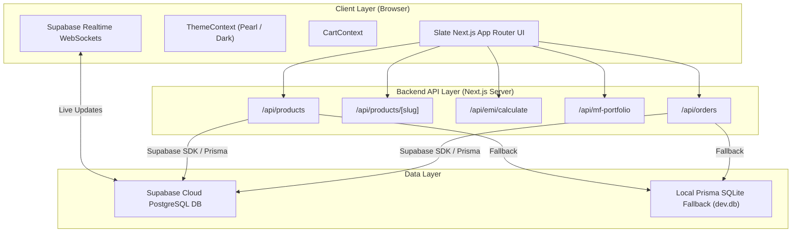
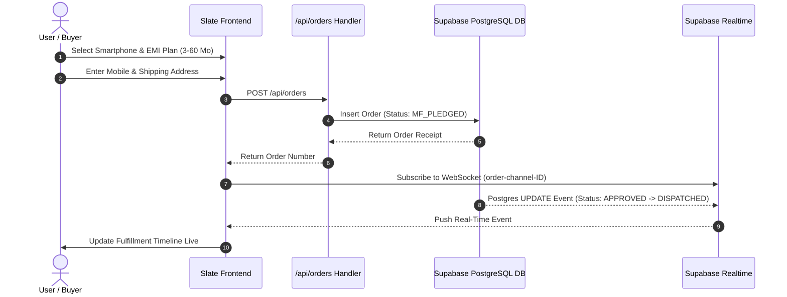
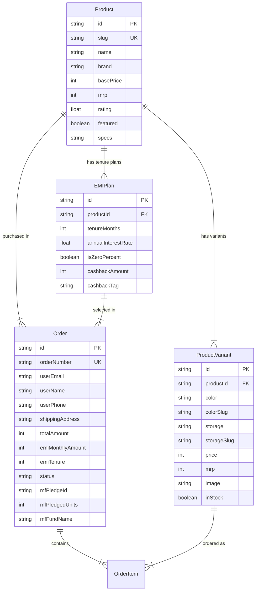

# Slate — Smartphone Store on Mutual Fund Credit

> **Purchase flagship smartphones using collateralized mutual fund-backed EMI financing plans with 0% portfolio liquidation.**

[](https://nextjs.org/)
[](https://www.typescriptlang.org/)
[](https://tailwindcss.com/)
[](https://supabase.com/)
[](https://www.prisma.io/)

---

## 📖 Table of Contents

- [Overview](#-overview)
- [Key Features](#-key-features)
- [Tech Stack](#-tech-stack)
- [System Architecture](#-system-architecture)
- [Database Schema](#-database-schema)
- [API Endpoints & Example Responses](#-api-endpoints--example-responses)
- [Setup & Installation Guide](#-setup--installation-guide)
- [Environment Variables](#-environment-variables)
- [Folder Structure](#-folder-structure)
- [License](#-license)

---

## 🌟 Overview

**Slate** is a consumer-grade fintech web application built to enable smartphone buyers to leverage their existing mutual fund investments for instant EMI credit. 

Instead of selling mutual fund units, incurring exit loads, or paying capital gains taxes, users pledge their units via CAMS/KFintech lien verification. 100% of their mutual fund wealth continues to earn market returns (14%+ expected CAGR) while paying low-cost monthly installments.

### Design System Highlights:
- **Pearl Aesthetic**: Soft warm pearl canvas (`#FAF8F5`), pure white card containers (`#FFFFFF`), and crisp pearl borders (`#E8E3D9`).
- **Playfair Display Typography**: High-end editorial typography for headers, titles, and pricing.
- **Light / Dark Theme Toggle**: Built-in Theme Switcher supporting Pearl Light Mode and Pearl Dark Mode.
- **Decluttered & Human Design**: Distraction-free layout with warm, conversational copywriting.

---

## 🚀 Key Features

1. **Dynamic Product & Variant Engine (`/products/[slug]`)**:
   - Route by slug (e.g. `/products/iphone-17-pro`, `/products/samsung-s24-ultra`).
   - Toggling variants (color finishes, 256GB/512GB/1TB storage) dynamically updates titles, high-res renders, prices, and EMI calculations in place.
   - Stateful URL synchronization (`?color=desert-titanium&storage=256gb`) for shareable deep links.

2. **Mutual Fund EMI Plan Engine**:
   - Dynamic tenure cards for 3, 6, 12, 24, 36, 48, and 60 months.
   - Displays 0% Interest pills, cashback tags, monthly installment amounts, and total interest.
   - Interactive review modal (`EMIBreakdownModal`) displaying collateral pledge requirements and preserved SIP market gains.

3. **Catalog & Advanced Filtering (`/products`)**:
   - Interactive Price Slider (₹40,000 to ₹200,000+).
   - Multi-brand checkboxes (Apple, Samsung, Google, OnePlus, Xiaomi, Vivo).
   - Storage capacity selector & 0% Interest toggle switch.
   - Shimmer skeleton loaders to prevent layout shifts (CLS).

4. **Checkout & Real-Time Order Tracking (`/checkout` & `/orders/[id]`)**:
   - Guest & Signed-in account options.
   - Mutual fund portfolio credit limit verification.
   - **Supabase Real-Time WebSockets**: Live order fulfillment timeline that updates status automatically as order state changes in the database.

---

## 🛠 Tech Stack

| Tier | Technology | Purpose |
| :--- | :--- | :--- |
| **Framework** | Next.js 16 (App Router) | Server-side rendering, API route handlers, Turbopack |
| **Language** | TypeScript 5 | End-to-end static type safety |
| **Styling** | Tailwind CSS + Vanilla CSS | Responsive design tokens, Pearl color palette, Theme variables |
| **Typography** | Google Fonts (Playfair Display & Plus Jakarta Sans) | Editorial serif titles & clean sans-serif body text |
| **Database Tier** | Supabase PostgreSQL / SQLite via Prisma ORM | Relational database schema, migrations, and seed dataset |
| **Real-Time Engine** | `@supabase/supabase-js` | WebSocket channels for live order status subscriptions |
| **Icons** | Lucide React | Clean, accessible vector icons |

---

## 📐 System Architecture

### Application Architecture Diagram



### Order Fulfillment & Lien Flow



---

## 🗄 Database Schema

The database schema is managed via Prisma ORM ([schema.prisma](file:///c:/Users/Tanisha%20agarwal/PythonFiles/Engineer%20Surya/Career%20Search/1fi/smartphone-store/prisma/schema.prisma)).

### Entity Relationship Diagram



---

## 🔌 API Endpoints & Example Responses

### 1. `GET /api/products`
Retrieves products with support for search (`?q=`), brand filtering (`?brand=Apple,Samsung`), budget cap (`?maxPrice=150000`), zero-interest toggle (`?zeroInterest=true`), and sorting.

**Example Request:**
`GET /api/products?brand=Apple&sort=featured`

**Example Response:**
```json
{
  "success": true,
  "count": 1,
  "products": [
    {
      "id": "prod-17-pro",
      "slug": "iphone-17-pro",
      "name": "Apple iPhone 17 Pro",
      "brand": "Apple",
      "rating": 4.9,
      "basePrice": 134900,
      "mrp": 144900,
      "badge": "Flagship Launch",
      "variants": [
        {
          "color": "Natural Titanium",
          "colorSlug": "natural-titanium",
          "storage": "256GB",
          "storageSlug": "256gb",
          "price": 134900,
          "image": "https://images.unsplash.com/photo-1695048133142-1a20484d2569"
        }
      ],
      "emiPlans": [
        {
          "tenureMonths": 6,
          "annualInterestRate": 0,
          "isZeroPercent": true,
          "cashbackAmount": 5000,
          "cashbackTag": "Additional cashback of ₹5,000"
        }
      ]
    }
  ]
}
```

---

### 2. `GET /api/products/[slug]`
Returns complete variant finishes, storage capacity options, and tenure EMI rates for a single smartphone.

**Example Request:**
`GET /api/products/iphone-17-pro`

**Example Response:**
```json
{
  "success": true,
  "product": {
    "slug": "iphone-17-pro",
    "name": "Apple iPhone 17 Pro",
    "brand": "Apple",
    "basePrice": 134900,
    "variants": [...],
    "emiPlans": [...]
  }
}
```

---

### 3. `POST /api/emi/calculate`
Calculates exact monthly installments, interest breakdown, cashback discounts, and mutual fund credit collateral metrics.

**Example Request Body:**
```json
{
  "principal": 134900,
  "tenureMonths": 12,
  "annualInterestRate": 0,
  "cashbackAmount": 3000
}
```

**Example Response:**
```json
{
  "success": true,
  "data": {
    "principal": 134900,
    "tenureMonths": 12,
    "monthlyInstallment": 11242,
    "totalInterest": 0,
    "cashbackAmount": 3000,
    "netEffectivePayable": 131900,
    "mfPledgeDetails": {
      "requiredCollateralValue": 141645,
      "estimatedSIPCompoundingGain": 18886,
      "benefitNote": "Keep earning up to ₹18,886 in mutual fund SIP growth during your 12-month tenure!"
    }
  }
}
```

---

### 4. `POST /api/orders`
Submits a new order and registers mutual fund unit pledge.

**Example Request Body:**
```json
{
  "userType": "guest",
  "userEmail": "rahul.sharma@example.com",
  "userName": "Rahul Sharma",
  "userPhone": "9876543210",
  "shippingAddress": {
    "street": "Flat 402, Cyber Towers, Hitec City",
    "city": "Hyderabad",
    "state": "Telangana",
    "pincode": "500081"
  },
  "totalAmount": 134900,
  "emiMonthlyAmount": 11242,
  "emiTenure": 12,
  "emiPlanId": "plan-12m",
  "productId": "prod-17-pro",
  "variantColor": "Natural Titanium",
  "variantStorage": "256GB"
}
```

**Example Response:**
```json
{
  "success": true,
  "message": "Order created successfully",
  "order": {
    "orderNumber": "SLATE-ORD-982341",
    "status": "MF_PLEDGED",
    "mfPledgeId": "MFP-583920",
    "mfPledgedUnits": 164,
    "mfFundName": "HDFC Top 100 Fund - Growth"
  }
}
```

---

## ⚡ Setup & Installation Guide

### Prerequisites
- **Node.js**: `v18.0.0` or higher (Tested on `v24.14.1`)
- **npm**: `v9.0.0` or higher

### 1. Clone & Install Dependencies
```bash
git clone <repository-url>
cd smartphone-store
npm install
```

### 2. Configure Environment Variables
Create a `.env.local` file in the root directory:
```env
NEXT_PUBLIC_SUPABASE_URL=https://your-supabase-project.supabase.co
NEXT_PUBLIC_SUPABASE_ANON_KEY=your-supabase-anon-key
```

### 3. Initialize & Seed Database
```bash
# Push schema to SQLite/PostgreSQL
npx prisma db push

# Seed flagship products, variants, and EMI plans
npx prisma db seed
```

### 4. Start Development Server
```bash
npm run dev
```
Open **`http://localhost:3000`** in your browser.

### 5. Production Build & Start
```bash
npm run build
npm start
```

---

## 📂 Folder Structure

```
smartphone-store/
├── prisma/
│   ├── schema.prisma       # Prisma DB schema definition
│   ├── seed.ts             # Dataset seed script
│   └── dev.db              # Embedded SQLite fallback database
├── public/                 # Static SVG assets & favicons
├── src/
│   ├── app/
│   │   ├── api/            # Backend REST API route handlers
│   │   │   ├── emi/
│   │   │   ├── mf-portfolio/
│   │   │   ├── orders/
│   │   │   └── products/
│   │   ├── checkout/       # Checkout & MF verification page
│   │   ├── orders/         # Orders listing & Real-time tracking
│   │   ├── products/       # Catalog & PDP routes
│   │   ├── globals.css     # Pearl design system tokens
│   │   ├── layout.tsx      # Root layout & Playfair Display font import
│   │   └── page.tsx        # Editorial homepage
│   ├── components/         # Reusable UI components
│   │   ├── CartDrawer.tsx
│   │   ├── EMIBreakdownModal.tsx
│   │   ├── EMISelectionEngine.tsx
│   │   ├── MFTrustBanner.tsx
│   │   ├── MobileStickyBar.tsx
│   │   ├── Navbar.tsx
│   │   ├── ProductCard.tsx
│   │   ├── ProductFilterSidebar.tsx
│   │   └── ProductGallery.tsx
│   ├── context/
│   │   ├── CartContext.tsx # Shopping cart state
│   │   └── ThemeContext.tsx# Pearl Light / Dark mode toggle state
│   ├── lib/
│   │   ├── prisma.ts       # Prisma Client singleton instance
│   │   └── supabase.ts     # Supabase SDK client & WebSockets helper
│   └── types/
│       └── index.ts        # TypeScript interface definitions
├── .env.local              # Local environment variables template
├── package.json
└── README.md
```

---

## 📄 License

Distributed under the **MIT License**. Built for demonstration purposes by Slate Technologies.
